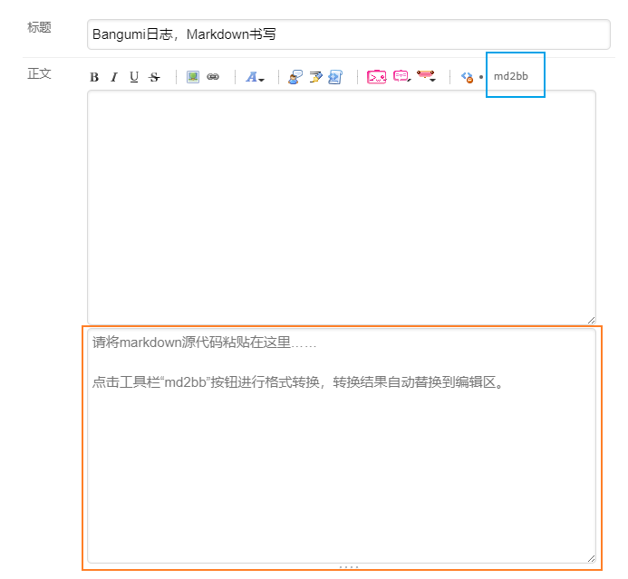
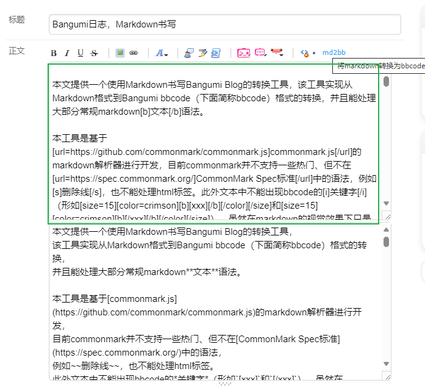

# Bangumi-Blog-Markdown脚本说明

想在本地使用[点这里](https://github.com/furtherun/bangumi-blog-markdown-desktop)！

在日志编辑页面增加Markdown一键转换为Bangumi BBCode的功能（蓝色方框）。
将写好的markdown源代码复制到下方输入区（橙色方框）中，点击“md2bb”按钮即可。



点击后会自动替换上方编辑区中的文本（绿色方框），**需要保留原来的文本，请自行备份**。

在最终保存前都可以通过刷新页面的方式，回退到上次保存。



## 相关链接

- [markdown端预览效果](https://github.com/furtherun/bangumi-blog-markdown-desktop/blob/main/test/article.md)
- [bbcode的预览效果](https://bgm.tv/blog/330695)
- [markdown文本源码](https://github.com/furtherun/bangumi-blog-markdown-desktop/blob/main/test/article.md)
- [bbcode转换结果](https://github.com/furtherun/bangumi-blog-markdown-desktop/blob/main/test/article.bb.md)

## 外部依赖

```js
// @require 	 https://cdn.jsdelivr.net/npm/html-escaper@3.0.3/index.min.js
// @require      https://cdn.jsdelivr.net/npm/commonmark@0.29.3/dist/commonmark.min.js
```

## 参考项目

- [markdown-to-bbcode](https://github.com/ddormer/markdown-to-bbcode)
- [commonmark.js](https://github.com/commonmark/commonmark.js)
- [html-escaper](https://github.com/WebReflection/html-escaper)